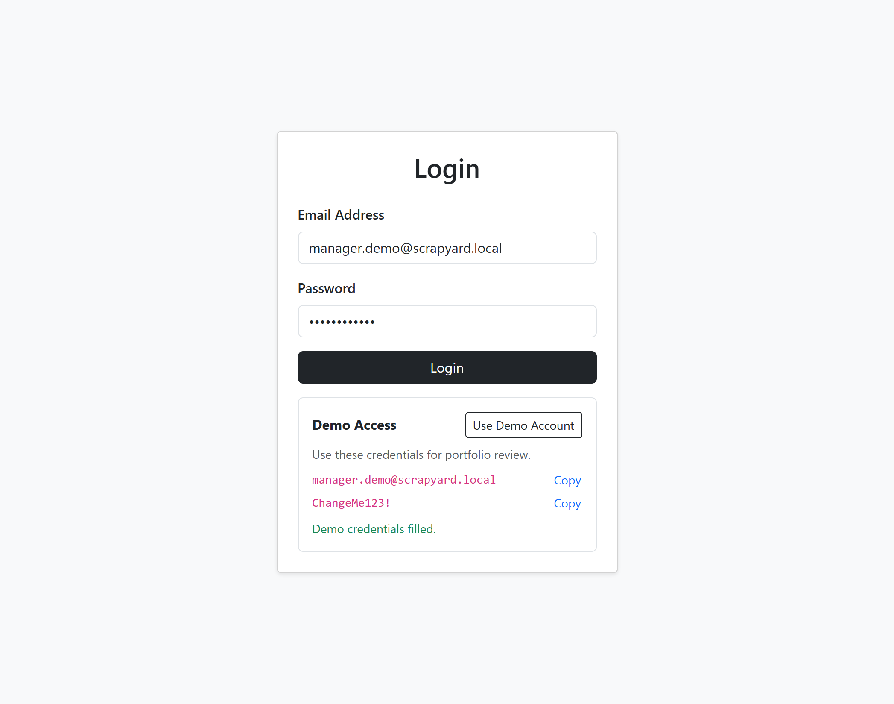
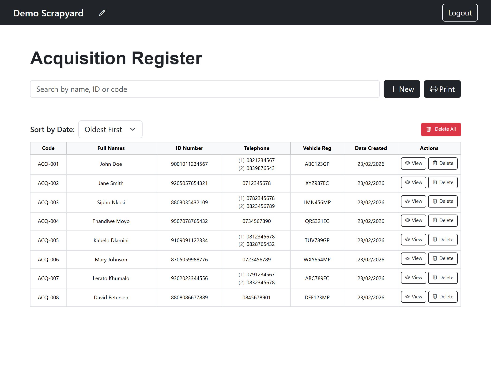
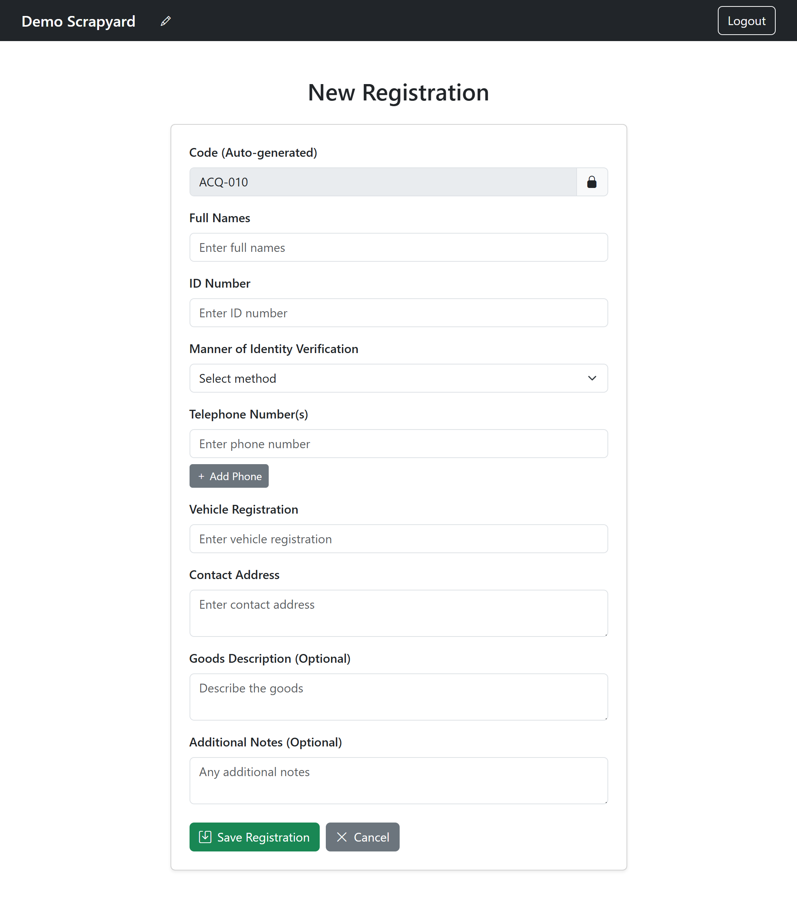
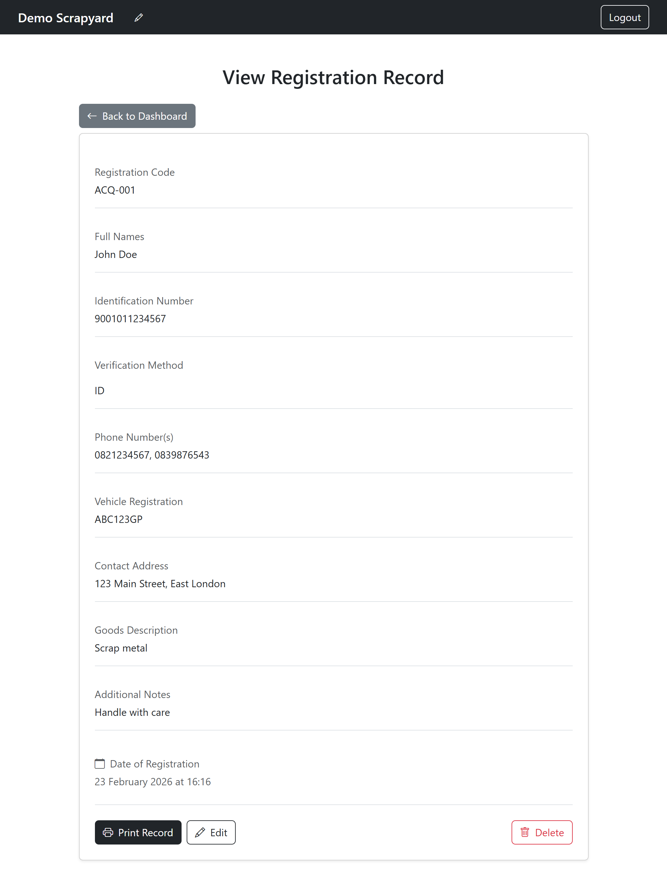

# Scrapyard Registration Frontend (Portfolio)

React + Vite frontend for the scrapyard acquisition register demo.

## Live Links
- Live App: `https://scrapyard-frontend-portfolio.onrender.com`
- Backend API Repo: `https://github.com/matthewjmon/scrapyard-backend-portfolio`
- Frontend Repo: `https://github.com/matthewjmon/scrapyard-frontend-portfolio`

## Project Impact
This frontend represents the portfolio-safe version of a real, paid production application built for a local scrapyard business.

### Problem Context
- Registration workflows were slow and largely manual.
- Staff had to manage repeated customer details, increasing duplicate entries.
- Day-to-day record lookup and printing for operational use were inefficient.

### Frontend Contribution
- Delivered a clean, task-focused dashboard for high-frequency data capture.
- Added record search, sorting, edit/view flows, and print-friendly output.
- Implemented a simple, role-appropriate authenticated UI for business staff.

### Business Value
- Improved registration speed and reduced friction during busy intake windows.
- Increased data consistency through structured forms and predictable workflows.
- Reduced duplicate records and improved operational confidence in stored data.

Note: This repository is sanitized for portfolio demonstration and excludes production credentials/data.

## Tech Stack
- React
- React Router
- Axios
- Bootstrap 5
- Vite

## Key Features
- JWT login flow
- Protected dashboard and record routes
- Record search, sorting, create, edit, view, delete
- Print-friendly register view
- Demo-access helper on login screen for quick reviewer testing

## Screenshots
### Login
Clean authentication entry point with demo-access helpers for quick reviewer onboarding.



### Dashboard
Main operations view with searchable/sortable records and fast action controls.



### New Record Form
Structured form workflow to standardize data capture and reduce entry mistakes.



### Record Details
Detailed record view for verification and operational traceability.



### Print View
Print-friendly register layout for physical filing and compliance workflows.


## Environment Variables
Create `.env` for local development:

```env
VITE_API_URL=http://localhost:5001/api
```

Set `.env.production` before deployment:

```env
VITE_API_URL=https://scrapyard-backend-portfolio.onrender.com/api
```

## Local Setup
```bash
npm install
npm run dev
```

## Scripts
- `npm run dev` start local Vite server
- `npm run build` production build
- `npm run preview` preview production build
- `npm run lint` run ESLint

## Deploy on Render (Static Site)
1. Create a new Static Site from this repo.
2. Build command: `npm install && npm run build`
3. Publish directory: `dist`
4. Add env var: `VITE_API_URL` pointing to deployed backend API.

## Demo Credentials
- Email: `manager.demo@scrapyard.local`
- Password: `ChangeMe123!`

These are seeded from the backend using `npm run create-user`.

## Portfolio Notes
- UI and flows are designed to represent a practical CRUD business app.
- Sensitive production configuration and credentials are intentionally excluded.
